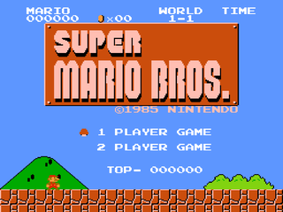

# Super Mario Bros.

> [!IMPORTANT]
> This project is intended for educational and archival purposes only.  
> It is not affiliated with, endorsed by, or sponsored by Nintendo Co., Ltd.  
> All trademarks and intellectual property remain the property of their respective owners.  



Super Mario Bros. is a 1985 platform game developed and published by Nintendo for the Nintendo Entertainment System. Directed and produced by Shigeru Miyamoto, it is the successor to the 1983 arcade game Mario Bros. and the first game in the Super Mario series. Players control Mario, or his brother Luigi in the multiplayer mode, to traverse the Mushroom Kingdom to rescue Princess Toadstool from King Koopa. They traverse side-scrolling stages while avoiding hazards such as enemies and pits and collecting power-ups such as the Super Mushroom, Fire Flower and Starman.

## Building
### Prerequisites
You will need theese first:
- Linux based distrobution
- `git`
- GNU Toolchain (e.g., `gcc`, `binutils`, `make`.)
- `cmake`

### Cloning
Now you will need to get the actual code:
```
git clone --depth=1 https://github.com/GNUfault/Super-Mario-Bros..git
cd Super-Mario-Bros.git
```

### NES 6502 Assembler
You will need a spectial assembler for the NES, here is how to get it:

#### Cloning
```
git clone --depth=1 https://github.com/freem/asm6f.git
cd asm6f
```

#### Compile
Now compile the assembler:
```
make -j$(nproc)
```

#### Get back to project root
After you are done you want to get back to the projects root
```
cd ..
```

### Emulator
You will need a NES emulator to run the game on your computer, here is how to get it:

#### Cloning
```
git clone --depth=1 https://github.com/TASEmulators/fceux.git
cd fceux
```

#### Configuring
```
cmake .
```

#### Compiling
```
make -j$(nproc)
```

### Get back to project root
After you are done you want to get back to the projects root
```
cd ..
```

### Compiling
```
make
```

## Running
```
make run
```
